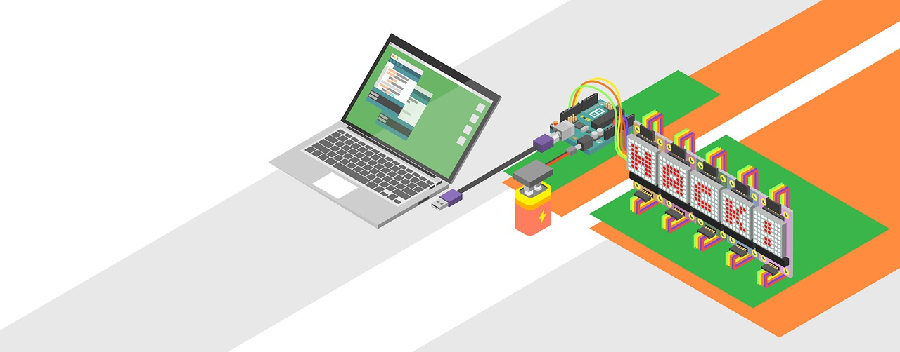

# arduino

A collection of arduino sketches.

## Overview

### LEDs
Who doesn't like LEDs?
- [Basic LED](led-basic/led-basic.ino) - hello world for LEDs
- [Pushbutton LED](led-button/led-button.ino) - using a pushbutton to control the LED
- [Pushbutton LED with debouncing](led-button-debouncing/led-button-debouncing.ino) - using a pushbutton with debouncing to control the LED
- [Breathe LED](led-breathe/led-breathe.ino) - breathe/fade effect for an LED

